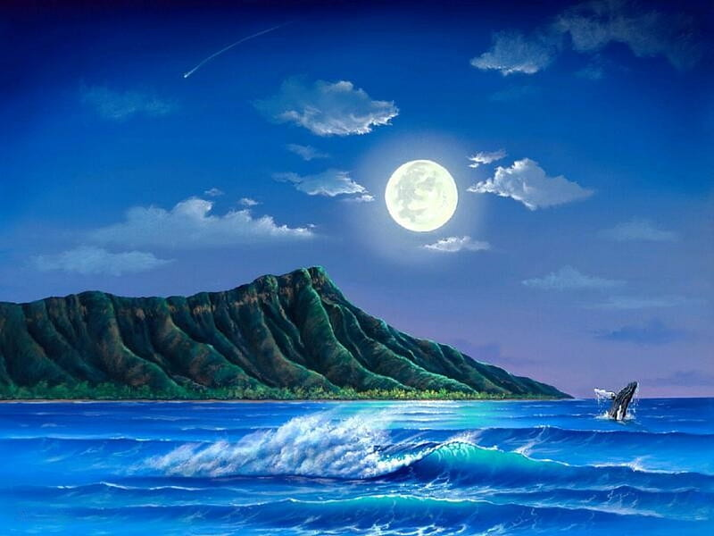
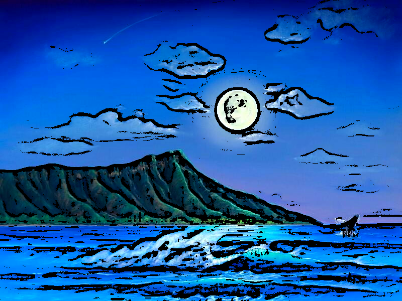

# 🎨 Cartoonify

**Cartoonify** is a professional-grade Streamlit application that applies advanced computer vision techniques to convert photographs into vibrant, hand-drawn cartoon–style images. Leveraging OpenCV, NumPy, and Pillow, users may upload any JPG or PNG file and interactively adjust processing parameters via intuitive sidebar controls.

This app is the first in a forthcoming series of image-processing tools, inspired by the recent “Ghibli filter” trend sweeping social media. Future releases will include pencil-sketch, watercolor, and film-noir effects—every tool designed to let you unleash your creative vision with zero coding.

👉 **Live Demo**: [Click here to try it out](https://shivekmaharaj-cartoonify.streamlit.app)  
📦 **Built With**: Python · Streamlit · OpenCV · Pillow · NumPy

---

## ✨ Features

- **Photo Upload**  
  Accepts JPG and PNG images up to 5 MB.  
- **Real-Time Parameter Controls**  
  - **Diameter (d)**: Pixel radius for the bilateral filter—larger values produce smoother color regions.  
  - **Sigma Color (σcolor)**: Color‐space standard deviation for bilateral filtering—higher values preserve more color variance.  
  - **Sigma Space (σspace)**: Spatial standard deviation for bilateral filtering—larger values respect spatial proximity over color.  
  - **Median Blur Kernel Size**: Odd‐sized window for median blur noise reduction before edge detection.  
  - **Adaptive Threshold Block Size**: Neighborhood size (odd) for computing local thresholds in edge detection.  
  - **Adaptive Threshold C-value**: Constant subtracted from the mean in adaptive thresholding—controls edge sensitivity.  
- **Enhancements**  
  - **Soft Edges**: Applies an edge-preserving filter for a softer, painterly finish.  
  - **Color Saturation Boost**: Intensifies color vibrancy after cartoonification.  
- **Side-by-Side Viewer**  
  Compare original and processed images at a glance.  
- **Downloadable Output**  
  Save your final cartoonified PNG with one click.

---

## 🖼️ Sample Input

*Original photograph before processing:*

---

## 📸 Sample Result

*Cartoonified output using the default settings:*

---

## 🛠️ Parameter Details

| Parameter                   | Description                                                                                 | Default |
|-----------------------------|---------------------------------------------------------------------------------------------|:-------:|
| **Diameter (d)**            | Radius of each pixel’s neighborhood in the bilateral filter. Larger → smoother regions.      |    9    |
| **Sigma Color (σcolor)** | How dissimilar colors are mixed. Higher → more color retained.                               |  250    |
| **Sigma Space (σspace)** | How far (in pixels) to blend. Higher → larger spatial smoothing.                            |  250    |
| **Median Blur Kernel Size** | Size of the window for median blur. Must be odd; larger → stronger noise removal.            |    7    |
| **Adaptive Threshold Block Size** | Pixel neighborhood size for adaptive thresholding; must be odd.                           |    9    |
| **Adaptive Threshold C-value**     | Constant subtracted from the local mean; higher → fewer detected edges.                   |    2    |
| **Soft Edges**              | Edge-preserving smoothing for a softer look.                                                 |  Off    |
| **Color Saturation Boost**  | Multiplier (×1.5) on color channels to heighten vibrancy.                                    |  Off    |

---

## 🔍 How It Works

1. **Bilateral Filtering**  
   Smooths color regions while preserving strong edges—mimics digital painting.  
2. **Median Blur**  
   Eliminates small noise artifacts prior to edge detection.  
3. **Adaptive Thresholding**  
   Computes a local threshold for each pixel to extract crisp, comic-style outlines.  
4. **Masking & Merging**  
   Combines the smoothed color image with the binary edge mask.  
5. **Optional Enhancements**  
   Soft edge filter and saturation boost add final artistic touches.

---

## 🙌 Created by

**Shivek Maharaj**  
[LinkedIn](https://www.linkedin.com/in/shivek-maharaj/) · [GitHub](https://github.com/ShivekMaharaj)  

*Part of an upcoming suite of stylized image-processing apps—stay tuned for Sketchify, Watercolorizer, and more!*
